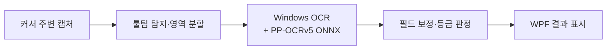

<div align="center">

# no-kalbak

**던전앤파이터 장비 툴팁 인식 · 능력치 비교 도구**

장비에 마우스를 올리면 등급과 능력치를 읽고, 칼레이도 박스 사용 판단을 돕습니다.


[시연 영상](#시연-영상) · [빠른 시작](#빠른-시작) · [설계와 문제 해결](#설계와-문제-해결) · [성능 변화](#성능-변화) · [패치 노트](#패치-노트)

</div>

## 시연 영상

<p align="center">
  <a href="https://youtu.be/jsNqvN16rGI"></a>
</p>

## 주요 기능

| 기능 | 동작 |
|---|---|
| **장비 툴팁 인식** | 커서 주변 화면에서 툴팁을 찾아 레어리티·부위·품질·주능력치를 추출합니다. |
| **실시간 등급 판정** | 빠른 1차 결과를 표시하고 정밀 인식으로 보정합니다. `최상급` 여부를 우선 판정하며 능력치 기준값도 함께 표시합니다. |
| **착용 장비 비교** | Neople Open API의 착용 장비와 직접 읽은 능력치를 연결하고, 100% 기준값과 비교합니다. |
| **캐릭터별 기록** | 사용자가 확인한 실측값을 SQLite에 저장합니다. 장비 식별 정보가 달라지면 재인식을 요청합니다. |

OCR은 PC에서 실행하며 게임 화면을 외부 OCR 서버로 전송하지 않습니다. 캐릭터·장비 조회에는 Neople Open API를 사용합니다.

## 빠른 시작

**Windows 10 2004(빌드 19041) 이상 · x64 · 한국어 Windows OCR 구성요소**가 필요합니다.

1. [배포판 다운로드](https://github.com/Robinson-Lim/no-kalbak/releases/tag/v1.0.2)에서 `no-kalbak-runtime.zip`을 받아 쓰기 가능한 폴더에 **전체 압축 해제**합니다.
2. `config.json.sample`을 `config.json`으로 복사하고 본인의 Neople Open API 키를 입력합니다.
3. `DnfItemChecker.App.exe`를 실행하고 캐릭터를 선택합니다.
4. 인게임 인식을 시작한 뒤 게임 창에서 장비에 마우스를 올립니다.

.NET 런타임은 배포판에 포함되어 있습니다. `models/` 폴더는 실행 파일 옆에 유지하세요. API 키는 `NEOPLE_API_KEY` 환경 변수로도 설정할 수 있습니다. [설정과 사용 방법 →](docs/RUNTIME.md)

> **전체화면에서도 인식할 수 있습니다. 창 모드에서는 게임 화면을 클릭해 활성화한 뒤 사용하세요.** 다른 창을 클릭했다면 게임 화면을 다시 클릭해야 합니다.

`Code → Download ZIP`은 소스 코드입니다. 바로 실행하려면 위 배포판을 다운로드하세요.

## 설계와 문제 해결

화면·도메인 로직·영상 처리를 **App / Core / Vision** 프로젝트로 분리한 C# 데스크톱 애플리케이션입니다. Python OCR 프로토타입에서 출발해 Windows 환경의 로컬 인식과 장비 비교 흐름으로 확장했습니다.



착용 장비 등록에서는 OCR 결과를 API 장비 목록과 매칭한 후 사용자 확인을 거쳐 저장합니다. 이후 현재 장비의 식별 정보와 저장값이 일치할 때만 기준 능력치와 비교합니다. [전체 데이터 흐름과 코드 구조 →](docs/ARCHITECTURE.md)

| 기술적 과제 | 적용한 처리 | 코드·검증 |
|---|---|---|
| **인식 속도와 정확도** | 즉시·정밀 경로를 분리하고, 필드별 영역과 제한된 후보군으로 판독 범위를 좁힙니다. | [인식 파이프라인](src/DnfItemChecker.Vision/TooltipRecognizer.cs) · [모드 테스트](tests/DnfItemChecker.Vision.Tests/TooltipRecognizerModeTests.cs) |
| **취소·종료 시 충돌** | Windows OCR 엔진별 요청을 직렬화하고, ONNX 작업이 끝난 뒤 입력 이미지와 세션을 해제합니다. | [원인 분석](docs/OCR-CRASH-FIX.md) · [동시성 회귀 테스트](tests/DnfItemChecker.Vision.Tests/OcrConcurrencyTests.cs) |
| **장비와 실측값의 불일치** | 현재 아이템 ID·부위·레어리티·주능력치가 저장값과 맞는지 검사하고, 불일치 시 비교를 보류합니다. | [비교 로직](src/DnfItemChecker.Core/Comparison/ComparisonEngine.cs) · [비교 테스트](tests/DnfItemChecker.Core.Tests/ComparisonEngineTests.cs) |

## 성능 변화

Python OCR의 반복 개선에 따른 전체 필드 통과율과 C# 인식 경로의 평균 지연 변화입니다.


| 평가 대상 | 평가 조건 | 결과 |
|---|---|---|
| Python OCR 초기 기준 | 153장, 이름·레어리티·부위 / 전체 필드 | 17.6% / 2.00% |
| Python OCR 반복 개선 후 | 동일한 153장, iter #66 | 98.69%(151/153) / 96.08%(147/153) |
| C# 인식 경로 최적화 | `tests/pic` 20장, 평균 인식 지연 | 853ms → 244ms(고속 경로) → 315ms(정확도 보완) |
| 1.0.1 회귀 평가 | 143장, 핵심 필드 / 능력치 값 | 143/143 / 176/176, 평균 459ms, P95 548ms |

**측정 범위:** 1.0.1은 아이템 이름을 제외한 기존 데이터셋 회귀 평가입니다. 지연은 워밍업 후 인식 호출을 측정한 값으로 파일 읽기·화면 캡처·커서 대기·WPF 표시 시간은 제외합니다. 1회 측정 결과이며 실제 게임 환경 전체의 정확도나 응답 시간을 의미하지 않습니다. Python·C# 20장·1.0.1 평가는 데이터와 조건이 달라 서로 직접 비교할 수 없습니다.

[평가 기준과 실행 방법](docs/BENCHMARKS.md) · [1.0.1 측정 결과](docs/benchmarks/v1.0.1-regression.json) · [그래프 원자료](docs/benchmarks/performance-history.json) · [재생성 스크립트](tools/render-performance-history.py)

## 개발 및 빌드

Windows와 **.NET 10 SDK**가 필요합니다. 저장소를 내려받은 뒤 루트에서 실행합니다.

```powershell
dotnet test .\DnfItemChecker.slnx -c Release
.\build.ps1
$env:NEOPLE_API_KEY = "본인의 API 키"
.\run.ps1
```

빌드 결과는 `artifacts/publish/`, 배포 ZIP과 SHA-256은 `artifacts/`에 생성됩니다. 배포 스크립트는 실행 파일·모델·기준표·빈 설정 예제·설명서만 패키징합니다.

[배포 검증 결과](docs/VALIDATION.md): 자동 테스트 138개, NuGet 취약 패키지 감사, Windows x64 패키징을 확인했습니다.

| 경로 | 역할 |
|---|---|
| [`src/DnfItemChecker.App/`](src/DnfItemChecker.App) | WPF 화면, ViewModel, 실시간 인식·등록 상태 관리 |
| [`src/DnfItemChecker.Core/`](src/DnfItemChecker.Core) | API, SQLite, 텍스트 파싱, 능력치 비교 |
| [`src/DnfItemChecker.Vision/`](src/DnfItemChecker.Vision) | 화면 캡처, 툴팁 탐지, OCR 및 ONNX 모델 |
| [`tests/`](tests) | Core·Vision·App 자동 테스트 |
| [`tools/RecogProbe/`](tools/RecogProbe) | 데이터셋 평가와 라이브 캡처 검증 |
| [`stattable.json`](stattable.json) | 부위·레어리티별 기준 능력치 |

## 향후 개선 과제 (Future Work)

- **인식 정확도:** 다양한 해상도·UI 배율·툴팁 배치에 대한 평가를 확장하고, 실제 게임 화면의 오인식을 줄입니다.
- **응답성과 안정성:** 캡처부터 화면 표시까지의 지연과 장시간 연속 사용을 측정하고 개선합니다.
- **지원 장비 확장:** **“이계의 기운이 서린” 장비는 현재 인식되지 않습니다.** 해당 툴팁을 처리할 수 있도록 보완할 예정입니다.

## 패치 노트

### 1.0.2 — 2026-09-05

- 취약점 경고가 발생하던 네이티브 SQLite 패키지를 2.1.13으로 갱신했습니다.
- GDI+ 이미지 코덱을 사용하는 Vision 테스트 클래스를 순차 실행해 간헐적인 인코더 초기화 실패를 방지했습니다. OCR 동시 호출은 전용 회귀 테스트에서 계속 검증합니다.
- 자동 테스트 138개와 NuGet 취약 패키지 감사를 통과했습니다. [배포 검증 결과](docs/VALIDATION.md)

### 1.0.1 — 2026-09-04

- 반복 인식 중 취소 요청과 다음 인식이 겹칠 때 Windows OCR 객체가 동시에 사용되던 문제를 수정했습니다.
- ONNX 추론 중 자원 해제와 재호출이 충돌하지 않도록 종료 순서를 보강했습니다.
- 자동 테스트 138개와 143장 데이터셋 회귀 평가를 통과했습니다. [원인과 검증 결과](docs/OCR-CRASH-FIX.md)

<details>
<summary><strong>이전 버전 · 2026년 4월–9월</strong></summary>

### 1.0.0 — 2026-09-04

- C#/.NET 10/WPF 소스와 Windows x64 self-contained 배포 구조를 구성했습니다.
- 개인 API 키·DB·로그·게임 캡처를 제외하고, 실행에 필요한 ONNX 모델과 기준 능력치 표만 저장소와 배포 ZIP에 포함했습니다.
- 자동 테스트 134개, 전체 143장 데이터셋의 핵심 필드 143/143과 능력치 값 176/176, 별도 폴더 배포 스모크 테스트를 통과했습니다. [1.0.0 검증 결과](docs/REVIEW.md)

### 2026-09 · 실사용 흐름과 구조화 OCR

- 인식을 빠른 즉시 경로와 정확도 중심의 정밀 경로로 분리하고, 필드별 ROI와 제한된 후보군을 이용하는 구조화 판독을 추가했습니다.
- 창 전환, 같은 위치 재인식, 시간 초과와 취소 상황에서 실시간 인식이 영구 정지하지 않도록 상태 관리를 보강했습니다.
- 착용 장비 등록을 캐릭터와 부위 기준으로 단순화하고, 장비가 바뀌면 과거 측정값을 재사용하지 않도록 SQLite 저장 구조를 변경했습니다.

### 2026-07 · C# OCR 정확도·속도 개선

- 픽셀 기반 툴팁 탐지, 텍스트 행 분할, Windows OCR과 PP-OCRv5 ONNX의 혼합 경로를 도입했습니다.
- 같은 20장 `tests/pic`의 평균 지연을 853ms에서 315ms로 줄였고, 레어리티·부위 20/20을 유지했습니다.
- 라이브 실패 캡처 22장의 정밀 경로 회귀 평가에서 22/22를 기록하고, 실패 캡처를 보존하는 회귀 분석 흐름을 마련했습니다.

### 2026-06 · C#/.NET 재작성

- Python/PyQt5 앱을 C#/.NET 10/WPF로 재작성하고 Core, Vision, App, Tests 프로젝트로 분리했습니다.
- 아이템 이름 DB 매칭 중심 구조를 `(부위 × 레어리티)` 능력치 기준표 비교 방식으로 바꿨습니다.
- Windows OCR, 비동기 API 클라이언트, SQLite 로스터와 단일 파일 배포 기반을 구축했습니다.

### 2026-05 · Python OCR 확장판

- Tesseract 단일 인식에서 WinRT, EasyOCR, PaddleOCR 다중 pass 결과를 합치는 방식으로 확장했습니다.
- 613개 아이템 카탈로그와 153장 라벨 평가셋을 만들고, 이름·레어리티·부위 기준 98.69%, 전체 필드 기준 96.08%까지 개선했습니다.
- 실제 게임 화면에서는 UI 텍스트 혼입과 동적 툴팁 위치에 취약했습니다.

### 2026-04 · Python 초기 프로토타입

- PyQt5, Tesseract, Neople Open API와 SQLite를 이용해 장비 이름을 읽고 비교하는 첫 동작 버전을 만들었습니다.
- 커서 오른쪽의 고정 영역과 OCR 첫 줄에 의존해 툴팁 위치 변화와 이름 인식 오류에 취약했습니다.

</details>
