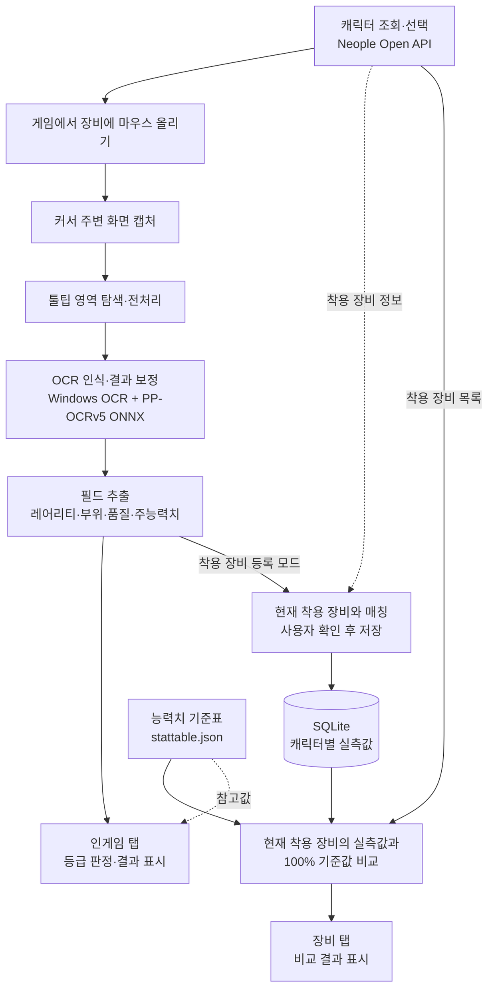
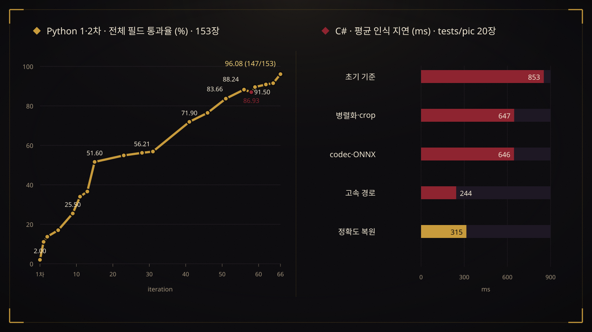

# no-kalbak

던전앤파이터 장비 툴팁을 인식해 실제 능력치를 비교하고, 칼레이도 박스 사용 판단을 돕는 Windows 프로그램입니다.
C# / .NET 10 / WPF로 작성했으며 Windows OCR과 PP-OCRv5 ONNX를 사용합니다.

## 시연 영상

[](https://youtu.be/jsNqvN16rGI)

썸네일을 클릭하면 YouTube에서 시연 영상을 볼 수 있습니다. [▶ 시연 영상 보기](https://youtu.be/jsNqvN16rGI)

## 프로그램 파이프라인

Neople Open API로 캐릭터와 착용 장비 정보를 조회하고, 게임 화면의 툴팁에서 실제 능력치를 읽어 판정에 활용합니다.



- **인식:** 빠른 1차 판독 후 정밀 인식으로 결과를 보정합니다. OCR은 PC에서 실행하며, 게임 화면을 외부 OCR 서버로 전송하지 않습니다.
- **인게임 판정:** `최상급` 여부를 우선 판단하고, 읽어 낸 능력치와 기준값을 함께 보여줍니다. 품질이 반드시 `100%`여야 최상급으로 판정되는 것은 아닙니다.
- **착용 장비 비교:** 등록 모드에서 실제 착용 아이템의 툴팁을 읽고 사용자가 저장합니다. 장비 탭에서는 현재 API 장비 정보와 일치하는 실측값만 비교하며, 저장값이 없거나 장비가 바뀌면 재인식을 요청합니다.

## 실행

Windows 10 2004(빌드 19041) 이상, x64 환경과 한국어 Windows OCR 언어 구성요소가 필요합니다.
배포 ZIP은 .NET 런타임을 포함합니다. 사용자가 .NET SDK를 설치할 필요는 없습니다.

1. 배포용 `no-kalbak-runtime.zip`을 **전체 압축 해제**합니다.
2. `config.json.sample`을 `config.json`으로 복사하고 본인의 Neople Open API 키를 입력합니다.
3. `DnfItemChecker.App.exe`를 실행합니다. `models/` 폴더도 실행 파일 옆에 있어야 합니다.

API 키는 `NEOPLE_API_KEY` 환경 변수로도 설정할 수 있습니다.
설정 파일, 캐릭터 DB, 로그는 실행 파일 옆에 저장되므로 쓰기 가능한 폴더에서 실행하세요.
자세한 안내는 [배포판 실행 안내](docs/RUNTIME.md)를 참고하세요.

### 사용 시 유의사항

**전체화면 모드에서도 장비 인식을 사용할 수 있습니다.**

> **창 모드에서는 반드시 게임 화면을 한 번 클릭해 게임 창을 활성화한 뒤 사용하세요.**
> 게임 창이 활성화되어 있어야 인식이 동작합니다. 프로그램이나 다른 창을 클릭한 뒤에는 게임 화면을 다시 클릭하고, 인식할 장비에 마우스를 올려주세요.

## 개발 및 빌드

Windows와 .NET 10 SDK가 필요합니다. 저장소 루트에서 실행합니다.

```powershell
dotnet test .\DnfItemChecker.slnx -c Release
.\build.ps1
$env:NEOPLE_API_KEY = "본인의 API 키"
.\run.ps1
```

스크립트 실행이 차단된 환경에서는 `powershell -ExecutionPolicy Bypass -File .\build.ps1`로 해당 실행에만 정책을 적용할 수 있습니다.

- 실행 파일: `artifacts/publish/DnfItemChecker.App.exe`
- 배포 ZIP: `artifacts/no-kalbak-runtime.zip`
- 무결성 확인: `artifacts/no-kalbak-runtime.zip.sha256`

빌드 스크립트는 실패 시 중단하며, 실행 파일·모델 4개·기준 능력치 표·빈 설정 예제·설명서만 ZIP에 넣습니다.
기존 실행 폴더에 개인 설정이나 DB가 생겨도 배포 ZIP에 포함하지 않습니다.

## 폴더 구성

| 경로 | 내용 |
|---|---|
| `src/DnfItemChecker.App/` | WPF 화면, 캐릭터 및 장비 등록 |
| `src/DnfItemChecker.Core/` | API, SQLite, 파싱, 능력치 비교 |
| `src/DnfItemChecker.Vision/` | 화면 캡처, 툴팁 탐지, OCR |
| `src/DnfItemChecker.Vision/models/` | 실행에 필요한 ONNX 모델과 한국어 사전, 총 약 18 MiB |
| `tests/` | Core, Vision, App 자동 테스트 |
| `tools/RecogProbe/` | 이미지 데이터셋 인식 및 라이브 캡처 검증 도구 |
| `stattable.json` | 배포에 사용하는 기준 능력치 표 |
| `docs/` | 실행, 벤치마크, 문제 해결 문서 |

## 성능 변화

Python 버전의 전체 필드 통과율과 C# 버전의 `tests/pic` 평균 인식 지연 변화입니다.



| 버전 | 평가 조건 | 결과 |
|---|---|---|
| Python 1차 | 153장, 이름·레어리티·부위 / 전체 필드 | 17.6% / 2.00% |
| Python 2차 | 동일한 153장, 이름·레어리티·부위 / 전체 필드 | 98.69%(151/153) / 96.08%(147/153) |
| C# 최적화 | `tests/pic` 20장, 평균 인식 지연 | 853ms → 244ms(고속 경로) → 315ms(정확도 보완) |
| 1.0.1 | 외부 143장, 핵심 필드 / 능력치 값 | 143/143 / 176/176, 평균 459ms, P95 548ms |

1.0.1 지연시간은 파일 입력부터 결과 반환까지의 측정값이며 화면 캡처, 커서 대기, WPF 표시 시간은 포함하지 않습니다. Python 평가셋, C# `tests/pic`, 1.0.1 외부 데이터셋은 측정 조건이 서로 다릅니다.

[그래프 원자료](docs/benchmarks/performance-history.json) · [재생성 스크립트](tools/render-performance-history.py) · [벤치마크 실행 방법](docs/BENCHMARKS.md)

## 향후 개선 과제 (Future Work)

현재 구현을 바탕으로 인식 정확도와 처리 성능을 높이고, 지원하는 장비의 범위를 확장할 예정입니다.

1. **인식 정확도 개선:** 다양한 화면 조건과 툴팁에서 발생하는 오인식을 줄이고, 장비 정보와 능력치를 더 정확하게 판독하도록 개선할 예정입니다.
2. **처리 성능 개선:** 화면 캡처부터 인식 결과 표시까지의 지연을 줄여, 연속으로 장비를 확인할 때의 응답성을 높일 예정입니다.
3. **미지원 장비 인식 확장:** **“이계의 기운이 서린” 장비는 현재 인식되지 않습니다.** 해당 장비의 툴팁도 처리할 수 있도록 인식 방식을 보완하고 지원할 예정입니다.

## 패치 노트

### 1.0.1 — 2026-09-04

- 반복 인식 중 취소 요청과 다음 인식이 겹칠 때 Windows OCR 객체가 동시에 사용되던 문제를 수정했습니다.
- ONNX 추론 중 자원 해제와 재호출이 충돌하지 않도록 종료 순서를 보강했습니다.
- 자동 테스트 138개와 전체 143장 데이터셋 재검증을 통과했습니다. [원인과 검증 결과](docs/OCR-CRASH-FIX.md)

### 1.0.0 — 2026-09-04

- C#/.NET 10/WPF 소스와 Windows x64 self-contained 배포 구조를 첫 공개 버전으로 정리했습니다.
- 개인 API 키·DB·로그·게임 캡처를 제외하고, 실행에 필요한 ONNX 모델과 기준 능력치 표만 저장소와 배포 ZIP에 포함했습니다.
- 자동 테스트 134개, 전체 143장 데이터셋의 핵심 필드 143/143과 능력치 값 176/176, 별도 폴더 배포 스모크 테스트를 통과했습니다. [1.0.0 검증 결과](docs/REVIEW.md)

### 2026-09 · 실사용 흐름과 구조화 OCR

- 인식을 빠른 즉시 경로와 정확도 중심의 정밀 경로로 분리하고, 필드별 ROI와 제한된 후보군을 이용하는 구조화 판독을 추가했습니다.
- 창 전환, 같은 위치 재인식, 시간 초과와 취소 상황에서 실시간 인식이 영구 정지하지 않도록 상태 관리를 보강했습니다.
- 착용 장비 등록을 캐릭터와 부위 기준으로 단순화하고, 장비가 바뀌면 과거 측정값을 재사용하지 않도록 SQLite 저장 구조를 변경했습니다.

### 2026-07 · C# OCR 정확도·속도 개선

- 픽셀 기반 툴팁 탐지, 텍스트 행 분할, Windows OCR과 PP-OCRv5 ONNX의 혼합 경로를 도입했습니다.
- 같은 20장 `tests/pic`의 평균 지연을 853ms에서 315ms로 줄였고, 레어리티·부위 20/20을 유지했습니다.
- 실제 라이브 실패 캡처 22장으로 정밀 경로 22/22를 달성하고, 실패 캡처를 보존하는 회귀 분석 흐름을 마련했습니다.

### 2026-06 · C#/.NET 재작성

- Python/PyQt5 앱을 C#/.NET 10/WPF로 재작성하고 Core, Vision, App, Tests 프로젝트로 분리했습니다.
- 아이템 이름 DB 매칭 중심 구조를 `(부위 × 레어리티)` 능력치 기준표 비교 방식으로 바꿨습니다.
- Windows OCR, 비동기 API 클라이언트, SQLite 로스터와 단일 파일 배포 기반을 구축했습니다.

### 2026-05 · Python OCR 확장판

- Tesseract 단일 인식에서 WinRT, EasyOCR, PaddleOCR 다중 pass 결과를 합치는 방식으로 확장했습니다.
- 613개 아이템 카탈로그와 153장 라벨 평가셋을 만들고, 이름·레어리티·부위 기준 98.69%, 전체 필드 기준 96.08%까지 개선했습니다.
- 실제 게임 화면에서는 UI 텍스트 혼입과 동적 툴팁 위치에 취약했습니다.

### 2026-04 · Python 초기 프로토타입

- PyQt5, Tesseract, Neople Open API와 SQLite를 이용해 장비 이름을 읽고 비교하는 첫 동작 버전을 만들었습니다.
- 커서 오른쪽의 고정 영역과 OCR 첫 줄에 의존했으며, 153장 평가셋 기준 이름·레어리티·부위 통과율 17.6%, 전체 필드 통과율 2.00%를 기록했습니다.
