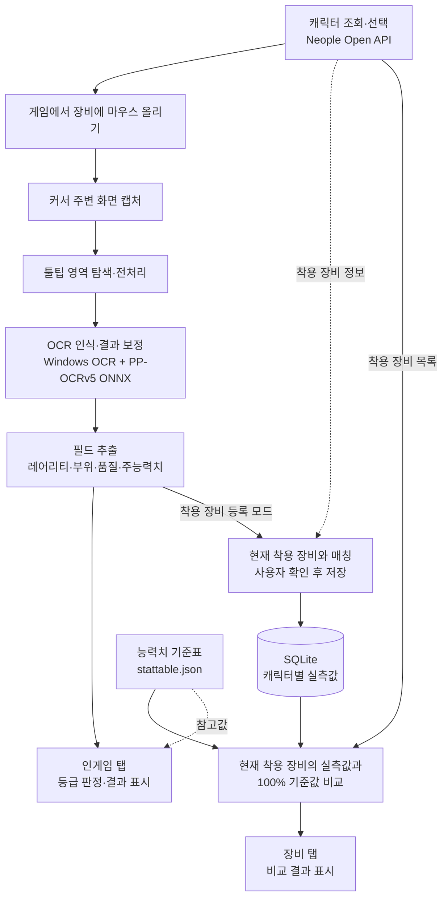

# 구조와 데이터 흐름

no-kalbak은 DNF 장비 툴팁에서 읽은 값과 API 장비 정보를 연결하는 Windows 데스크톱 도구입니다.

## 전체 흐름

## 프로젝트 경계

| 계층 | 책임 | 주요 진입점 |
|---|---|---|
| App | WPF 표시, 포커스·취소·등록 상태, 사용자 확인 | [InGameTabViewModel](../src/DnfItemChecker.App/ViewModels/InGameTabViewModel.cs) |
| Vision | 화면 캡처, 툴팁 위치와 필드 영역 탐지, 로컬 OCR | [TooltipRecognizer](../src/DnfItemChecker.Vision/TooltipRecognizer.cs) |
| Core | API 조회, 필드 파싱, 장비 매칭, 기준값 비교, 저장 | [ComparisonEngine](../src/DnfItemChecker.Core/Comparison/ComparisonEngine.cs) |

## 인식과 판정

일반 인게임 판정은 툴팁의 `최상급` 등급을 우선 사용합니다. 최상급이 반드시 품질 100%를 뜻하지는 않습니다. 읽어 낸 능력치와 기준표 값은 함께 표시합니다.

착용 장비 비교는 별도 흐름입니다. [EquippedItemMatcher](../src/DnfItemChecker.Core/Comparison/EquippedItemMatcher.cs)가 OCR 이름·부위·레어리티를 API 장비 목록과 매칭하고, 사용자가 확인한 관측값을 저장합니다. 비교 시 아이템 ID·부위·레어리티·주능력치가 일치하지 않으면 `미측정/재인식 필요`로 처리합니다. 같은 식별 정보의 장비에서 능력치만 바뀌는 경우에는 사용자가 다시 등록해야 합니다.

## 비동기 처리와 자원 수명

Windows OCR의 동일 엔진에는 한 번에 하나의 요청만 전달합니다. 취소가 들어와도 이미 시작한 native 인식이 끝날 때까지 입력 자원을 유지합니다.

ONNX의 병렬 lane도 모두 종료된 뒤 crop 이미지를 해제합니다. 따라서 취소 요청부터 실제 반환까지 시간이 걸릴 수 있습니다. 이 동작은 취소 응답 속도와 native 메모리 안전성 사이의 선택입니다.

[충돌 원인과 수정 검증](OCR-CRASH-FIX.md) · [실제 OCR을 사용하는 회귀 테스트](../tests/DnfItemChecker.Vision.Tests/OcrConcurrencyTests.cs)

## 로컬 처리와 외부 통신

- OCR: Windows OCR과 PP-OCRv5 ONNX를 로컬에서 실행합니다.
- 외부 조회: Neople Open API에서 캐릭터·장비 정보를 가져옵니다.
- 저장: SQLite에 캐릭터와 확인한 착용 장비 관측값을 저장합니다.
- 배포: [build.ps1](../build.ps1)의 허용 파일 목록으로 개인 설정·DB·로그를 제외합니다.
